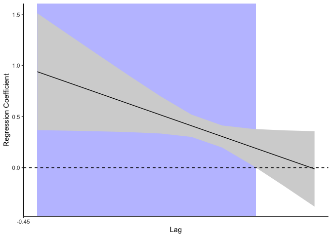

<!-- README.md is generated from README.Rmd. Please edit that file -->

# tidydlnm

<!-- badges: start -->
<!-- badges: end -->

The goal of tidydlnm is to make outputs from the package
[`dlnm`](https://github.com/gasparrini/dlnm) more tidyverse-friendly.

**Note: Only DLMs are currently supported. DLNM support coming soon.**

## Installation

You can install tidydlnm from [GitHub](https://github.com/) with:

``` r
# install.packages("devtools")
devtools::install_github("geomarker-io/tidydlnm")
```

## Example

Suppose we have the following data, where lags 0 through 9 are the
values of some exposure experienced 0 to 9 days before the outcome `y`.

    #> # A tibble: 100 × 11
    #>       lag0   lag1   lag2   lag3   lag4   lag5   lag6   lag7   lag8   lag9     y
    #>      <dbl>  <dbl>  <dbl>  <dbl>  <dbl>  <dbl>  <dbl>  <dbl>  <dbl>  <dbl> <dbl>
    #>  1  0.0608  0.309  1.29   1.29   0.782 -0.482 -0.886 -1.93  -1.57  -1.48   49.1
    #>  2  0.977   0.468 -0.480 -0.993 -0.483 -1.10  -2.97  -1.94  -3.00  -3.58   65.3
    #>  3 -2.14   -1.60  -1.10  -1.06  -1.26  -0.357 -1.40  -2.13  -3.20  -3.55   57.7
    #>  4  1.54    1.91   2.28   3.01   3.84   4.64   4.19   5.73   5.20   6.07   51.9
    #>  5 -0.0265  0.679 -0.100  1.63   3.12   3.33   3.83   3.82   2.35   0.195  48.4
    #>  6  0.454  -1.18  -1.79  -2.54  -3.46  -2.51  -1.93  -2.42  -3.52  -3.36   47.1
    #>  7  1.34    1.46   1.66   1.60   2.33   2.99   2.51   1.80   2.80   0.647  77.7
    #>  8 -0.480   1.61   2.55   3.04   2.95   2.20   2.14   2.81   4.10   4.31   69.3
    #>  9  0.921   1.26   0.229  2.78   2.26   1.51   4.18   5.91   6.45   6.97   62.0
    #> 10  0.599   0.442  0.534 -2.74  -2.61  -1.16   0.741  0.433 -0.918 -2.88   54.3
    #> # … with 90 more rows

First, use the `dlnm` package to fit a distributed lag model. We create
the crossbasis, fit the model, and create the crosspred object. (For
more info, see <https://github.com/gasparrini/dlnm>).

``` r
library(dlnm)
Q <- select(d, lag0:lag9)

cb <- crossbasis(Q, lag=9,
                   argvar=list("lin"),
                   arglag=list(fun="ns"))
mod <- lm(y ~ cb, data=d)
cpred <- crosspred(cb, mod, at=1, cumul = TRUE)
```

Then use `tidydlnm` to obtain more tidyverse-friendly output and plots,
including

- the estimates at each lag

``` r
library(tidydlnm)

lag_fits <- tidy_lag_fits(cpred)
tidy_lag_plot(lag_fits)
```


- the estimated effect over all lags

``` r
tidy_overall_fit(cpred)
#> # A tibble: 1 × 4
#>   estimate    se ci_lower ci_upper
#>      <dbl> <dbl>    <dbl>    <dbl>
#> 1     4.63 0.720     3.22     6.04
```

- cumulative effect estimates at each lag

``` r
cumul_fits <- tidy_cumul_fits(cpred)
```

Add optional shading to plot of estimates at each lag with the `shading`
argument.

``` r
tidy_lag_plot(lag_fits, shading = T)
```



Note that the same plotting function can be used to plot the cumulative
estimates. Also, since this is a ggplot object, the plot can be
customized as any other ggplot.

``` r
tidy_lag_plot(cumul_fits) +
  ylab("Estimate") +
  theme_minimal()
```


